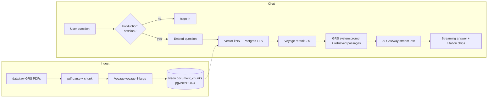

# DataGovAI — Utah GRS knowledge assistant

DataGovAI is a chat app for **Utah General Retention Schedules (GRS)**. A records officer asks a question in plain language (retention period, disposition, which series applies). The app searches ingested GRS PDFs, then streams an answer that must cite series ids such as `[GRS-19374]`.

It is **not legal advice**. Official confirmation still comes from [Utah State Archives](https://archives.utah.gov/).

Copyright © 2026 Utah Office of Data Privacy (ODP). All Rights Reserved.  
Collaboration: Utah Valley University, Smith College of Engineering and Technology.

**Live:** https://datagovai-web.vercel.app  
Development plan: [`docs/development/plan.md`](docs/development/plan.md). App code: [`web/`](web/).

---

## Login and test

### Production (shared demo)

1. Open **https://datagovai-web.vercel.app**
2. Click **Sign in** (or go to `/sign-in`).
3. Sign in with the **demo** account (shared for ODP testing):
   - **Email:** `admin@datagovai.local`
   - **Password:** `grsdemo`
4. You should land on the chat home with **Sign out** in the header.
5. Click a starter question or type your own. A good answer cites a series in brackets (for example `[GRS-11284]`) and shows matching chips under the message.
6. Click **Sign out** when finished. Without a session, production will not answer — you should see a sign-in prompt, not a broken error page.

| Starter | What to check |
|---------|----------------|
| Retention period for council minutes | Cites **GRS-19978** |
| Employee personnel files | Cites **GRS-19374** and/or **GRS-19375** |
| Disposition for audit records | Cites **GRS-28265** and/or **GRS-7695** |
| Retention schedule for legal case files | Cites **GRS-11284** |

Answers are grounded in ingested PDFs only. If a record type was never ingested, the assistant should say it could not find a matching schedule rather than invent a retention period.

### Local

```bash
cd web
cp .env.example .env.local   # set DATABASE_URL, AUTH_SECRET, Gateway auth
npm install
npm run db:push
npm run ingest -- --limit 20
npm run seed:admin
npm run dev
```

- Chat works **without** signing in during `next dev`.
- Optional shortcut on `/sign-in`: **`admin` / `admin`**.
- Retrieval-only check: `npm run smoke` (add `--generate` to also call the LLM).

---

## What you see in the product

1. **Home** — starter questions (council minutes, personnel files, audit records, legal case files) and a chat box.
2. **Sign in / Sign out** — production blocks `/api/chat` unless there is a session. Unsigned visitors get a sign-in prompt, not a raw 401. Local `next dev` allows chat without login.
3. **Answer + chips** — the model cites `[GRS-#####]` in the text. Chips under the message show only series ids that actually appear in that text (retrieved-but-unused neighbors are hidden).

---

## How the app works

Two pipelines: **ingest** (offline) writes the knowledge base; **chat** (every question) retrieves from it and generates an answer.



### 1. Ingest (building the knowledge base)

Script: [`web/scripts/ingest.ts`](web/scripts/ingest.ts).

- Reads PDFs from `data/raw/` (gitignored; keep the files on the machine that runs ingest).
- Filename `(GRS-12345)` becomes `sourceId` `GRS-12345`; the rest of the stem is the title.
- Text is split into ~1,600-character chunks (paragraph-aware, max 40 chunks per PDF).
- Each chunk is embedded with **Voyage `voyage-3-large`** (1024 dimensions) through the **Vercel AI Gateway** (`embed` / `embedMany` from the `ai` package — same auth path as chat).
- Rows are upserted into Neon table `document_chunks` (old rows for that `sourceId` are deleted first). HNSW indexes cosine distance on `embedding`.

Default `npm run ingest -- --limit 20` prefers series that match the UI starters, including:

| Series | Topic |
|--------|--------|
| GRS-19978 | Council minutes |
| GRS-28265 / GRS-7695 | Performance / accounting audit |
| GRS-19374 / GRS-19375 | Full-time / part-time personnel files |
| GRS-11284 | Legal case files |

One file: `npm run ingest -- --pdf ../data/raw/<file>.pdf`.

The chat **never reads PDFs at request time**. If a series is not ingested, the model should say it could not find a matching schedule.

### 2. Chat (answering a question)

UI: [`web/src/components/chat/chat.tsx`](web/src/components/chat/chat.tsx) (`useChat` → `POST /api/chat`).  
API: [`web/src/app/api/chat/route.ts`](web/src/app/api/chat/route.ts).  
Retrieve: [`web/src/lib/rag/retrieve.ts`](web/src/lib/rag/retrieve.ts).

1. **Auth** — in production, no session → `401`. The UI turns that into “sign in”.
2. **Embed the question** with the same Voyage model used at ingest (query and documents share one vector space).
3. **Hybrid retrieve**
   - Vector: nearest 20 chunks (`embedding <=> query`).
   - Keyword: Postgres `to_tsvector` / `plainto_tsquery` top 20.
   - Dedupe by chunk id.
4. **Rerank** with Voyage `rerank-2.5`; keep the top 5. If embed/rerank/SQL fails, retrieval returns `[]` and chat still streams (no citations, prompt says nothing was found).
5. **Generate** — `streamText` with:
   - Primary model `openai/gpt-4o-mini`
   - Gateway fallbacks: Claude Haiku 4.5, Gemini 2.5 Flash
   - Temperature `0.2`
   - System prompt ([`web/src/lib/ai/system-prompt.ts`](web/src/lib/ai/system-prompt.ts)): answer **only** from `<retrieved_context>`, cite `[GRS-…]` on facts, do not invent retention or disposition, not legal advice.
6. **Stream** the assistant message. Source metadata is attached at stream start; the client filters chips to ids present in the final text.
7. **Persist** (if signed in) a new `conversations` + `messages` row pair for that turn.

### 3. Authentication

Auth.js (NextAuth v5) credentials + JWT ([`web/src/auth.ts`](web/src/auth.ts)).

| Environment | Who can chat |
|-------------|--------------|
| `next dev` | Anyone; optional shortcut `admin` / `admin` |
| Production | Seeded user only (`npm run seed:admin`) |

Passwords are bcrypt hashes on the `user` table. `AUTH_SECRET` signs the JWT. `AUTH_URL` is the public origin (production: `https://datagovai-web.vercel.app`).

---

## Data stored in Neon

Postgres database **`datagovai`**. Schema: [`web/src/lib/db/schema.ts`](web/src/lib/db/schema.ts).

| Table | Role |
|-------|------|
| `user`, `account`, `session`, `verificationToken` | Auth.js |
| `document_chunks` | GRS text, `source_id`, 1024-d embedding, HNSW |
| `conversations`, `messages` | Optional chat history after a signed-in turn |

Apply schema: `cd web && npm run db:push`.

---

## Stack

| Layer | Choice |
|-------|--------|
| UI / API | Next.js 16 App Router, React 19, TypeScript |
| Chat | Vercel AI SDK v6 (`useChat`, `streamText`, `embed`, `rerank`) |
| Models | Vercel AI Gateway `provider/model` strings |
| Embed / rerank | `voyage/voyage-3-large`, `voyage/rerank-2.5` |
| Database | Neon Postgres + pgvector, Drizzle ORM |
| Auth | Auth.js credentials |
| Hosting | Vercel project `datagovai-web` |

Gateway calls on Vercel use platform auth automatically. Do **not** put `VERCEL_OIDC_TOKEN` or `AI_GATEWAY_API_KEY` in production env. Locally, copy them into `web/.env.local` (`vercel env pull` or an existing OIDC token) so ingest and `next dev` can call the Gateway.

---

## Repository layout

```
DataGovAI/
├── web/                          # The product
│   ├── src/app/                  # /, /sign-in, /api/chat, /api/auth
│   ├── src/components/chat/      # Chat UI + citation chips
│   ├── src/lib/rag/              # embed, retrieve, rerank
│   ├── src/lib/ai/               # models + GRS system prompt
│   ├── src/lib/db/               # Drizzle client + schema
│   ├── src/auth.ts
│   └── scripts/                  # ingest, seed-admin, smoke, push-env
├── data/raw/                     # GRS PDFs (local only; gitignored)
├── docs/development/plan.md      # Single development plan
└── README.md
```

---

## Run locally

Need: Node 20+, a Neon `DATABASE_URL` with pgvector, and Gateway credentials in `web/.env.local`.

```bash
cd web
cp .env.example .env.local    # fill DATABASE_URL, AUTH_SECRET, Gateway token
npm install
npm run db:push
npm run ingest -- --limit 20
npm run seed:admin
npm run dev
```

Open the URL Next prints (often http://localhost:3000). Local sign-in shortcut: `admin` / `admin`.

| Command | Purpose |
|---------|---------|
| `npm run ingest -- --limit 20` | Embed preferred PDFs from `../data/raw` |
| `npm run ingest -- --pdf ../data/raw/<file>.pdf` | One series |
| `npm run seed:admin` | Create/update admin user |
| `npm run smoke` | Retrieval check on starter questions (`--generate` also calls the LLM) |
| `npm run build` | Production build |

### Environment (`web/.env.local`)

| Variable | Purpose |
|----------|---------|
| `DATABASE_URL` | Neon connection string for `datagovai` |
| `AUTH_SECRET` | JWT signing secret |
| `AUTH_URL` | App origin (`http://localhost:3000` locally) |
| `ENABLE_DEV_LOGIN` | Local `admin`/`admin` shortcut (ignored in production) |
| `ADMIN_EMAILS` | Admin email list |
| `ADMIN_SEED_EMAIL` / `ADMIN_SEED_PASSWORD` | Optional overrides for `npm run seed:admin` (defaults: `admin@datagovai.local` / `grsdemo`) |
| `VERCEL_OIDC_TOKEN` / `AI_GATEWAY_API_KEY` | Local Gateway auth only |

Never commit `.env.local`.

---

## Deploy

Vercel project `datagovai-web` (CLI from `web/`):

```bash
cd web
./scripts/push-env.sh          # DATABASE_URL, AUTH_*, ADMIN_* → prod + development
vercel deploy --prod --yes
```

Set `AUTH_URL=https://datagovai-web.vercel.app` on Vercel. Do not push Gateway tokens.

Ingest against the **same** `DATABASE_URL` production uses, or production will search an empty corpus.

---

## Example questions

- What is the retention period for council minutes?
- How long should we keep employee personnel files?
- What are the disposition requirements for audit records?
- What is the retention schedule for legal case files?

Answers should name a series in brackets and match the ingested PDF (e.g. personnel files → GRS-19374 / GRS-19375).

---

## License

Copyright © 2026 Utah Office of Data Privacy (ODP). All Rights Reserved.

This software is proprietary and confidential to the Utah Office of Data Privacy. Unauthorized copying, modification, distribution, or use is prohibited.
