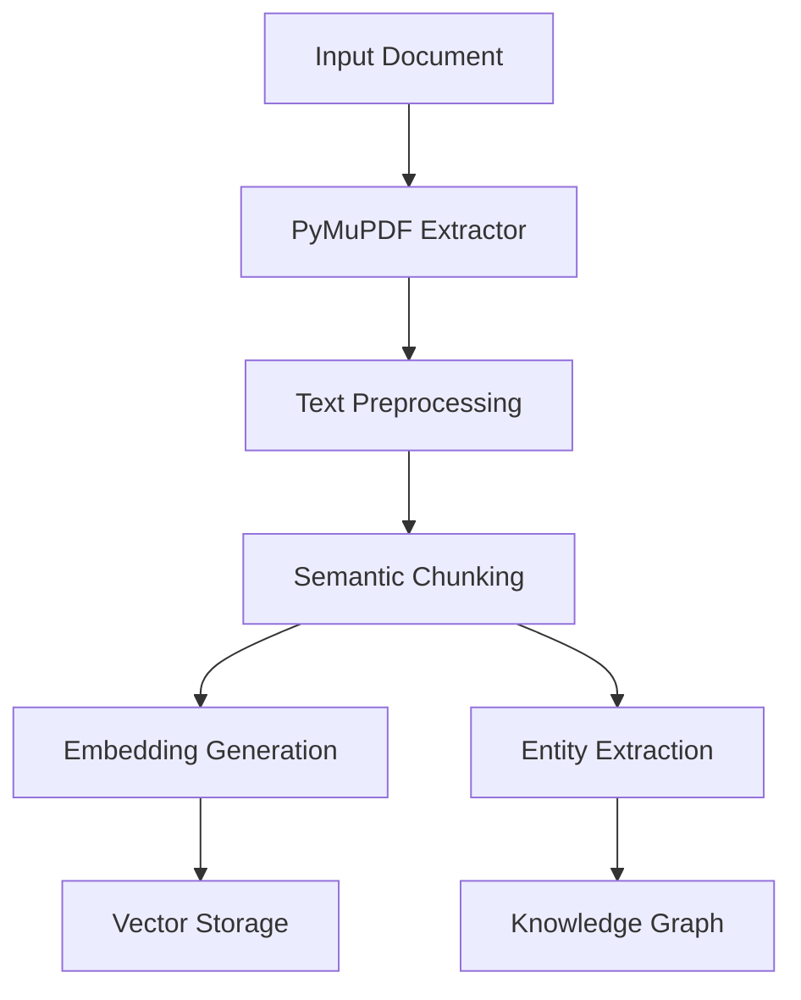
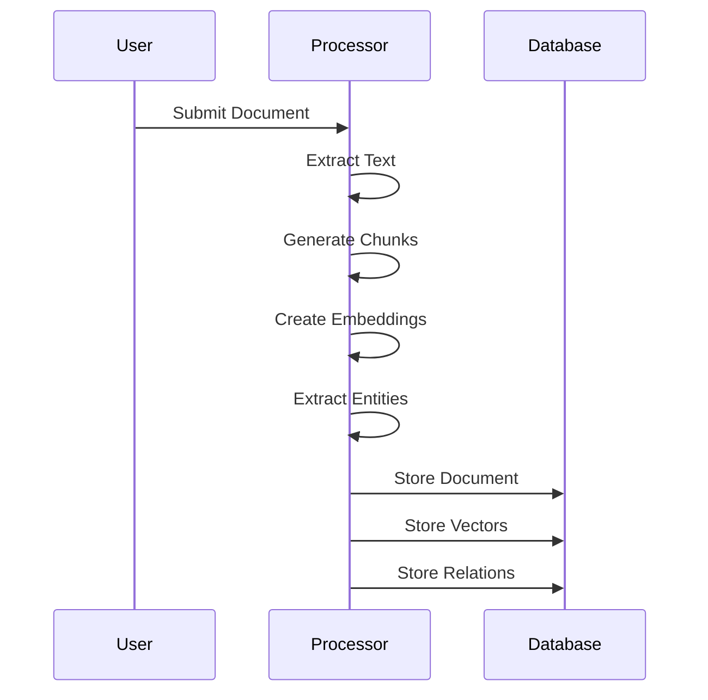
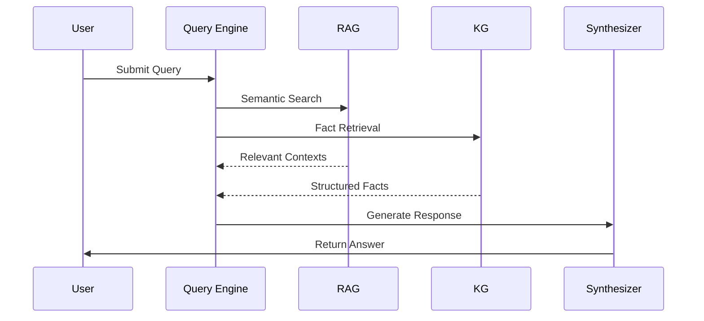

# 🏗️ DataGovAI Architecture

## System Overview

DataGovAI is built on a hybrid RAG (Retrieval-Augmented Generation) + KG (Knowledge Graph) architecture, specifically designed for processing and querying Utah's General Retention Schedules (GRS).

### High-Level Architecture

| Layer | Components | Purpose |
|-------|------------|---------|
| Interface | • Web UI • REST API • CLI | User interaction and data input |
| Processing | • Document Processor • Semantic Chunker • Entity Extractor | Document analysis and knowledge extraction |
| Storage | • PostgreSQL + pgvector • Vector Store • Knowledge Graph | Hybrid data storage |
| Query | • RAG Engine • KG Query Engine • Response Synthesizer | Intelligent query processing |

### Core Components

#### 1. Document Processing Pipeline

| Component | Technology | Purpose |
|-----------|------------|---------|
| PDF Extraction | PyMuPDF | High-quality PDF text extraction |
| Text Processing | NLTK/spaCy | Semantic text analysis |
| Chunking | Custom Algorithm | Context-aware document segmentation |
| Embedding | SentenceTransformers | Vector representation generation |
| Entity Extraction | Local LLM | Structured information extraction |

#### 2. Storage System

| Component | Implementation | Purpose |
|-----------|---------------|----------|
| Document Store | PostgreSQL | Original document storage |
| Vector Store | pgvector | Semantic search capabilities |
| Knowledge Graph | PostgreSQL | Structured relationship storage |

#### 3. Query System

| Component | Features | Implementation |
|-----------|----------|----------------|
| RAG Engine | • Semantic search • Context retrieval | SentenceTransformers + pgvector |
| KG Engine | • Fact retrieval • Relationship queries | SQL + Graph Queries |
| Synthesizer | • Answer generation • Source citation | Local LLM |

## Data Flow

### 1. Document Ingestion

### 2. Query Processing

## System Requirements

| Component | Requirement | Purpose |
|-----------|------------|----------|
| CPU | 4+ cores | Document processing |
| RAM | 16+ GB | Model operations |
| GPU | CUDA-capable | Embedding generation |
| Storage | 100+ GB SSD | Document storage |
| Database | PostgreSQL 14+ | Data management |

## Security Architecture

| Layer | Measures | Implementation |
|-------|----------|----------------|
| Authentication | • API keys • JWT tokens | Custom middleware |
| Authorization | • Role-based access • Document-level permissions | Database-level |
| Data Protection | • Encryption at rest • Secure connections | PostgreSQL features |

## Performance Optimization

| Area | Technique | Implementation |
|------|-----------|----------------|
| Embedding | Batch processing | GPU acceleration |
| Search | Vector indexing | pgvector indexes |
| Caching | Query results | Redis (optional) |

## Integration Points

| System | Integration Type | Purpose |
|--------|-----------------|----------|
| Document Management | REST API | Document ingestion |
| User Systems | OAuth2 | Authentication |
| Monitoring | Prometheus/Grafana | System metrics |

For detailed component documentation, see:
- [Component Details](./components.md)
- [Data Flow](./data_flow.md)
- [Security Implementation](./security.md) 