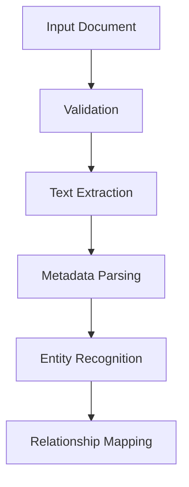
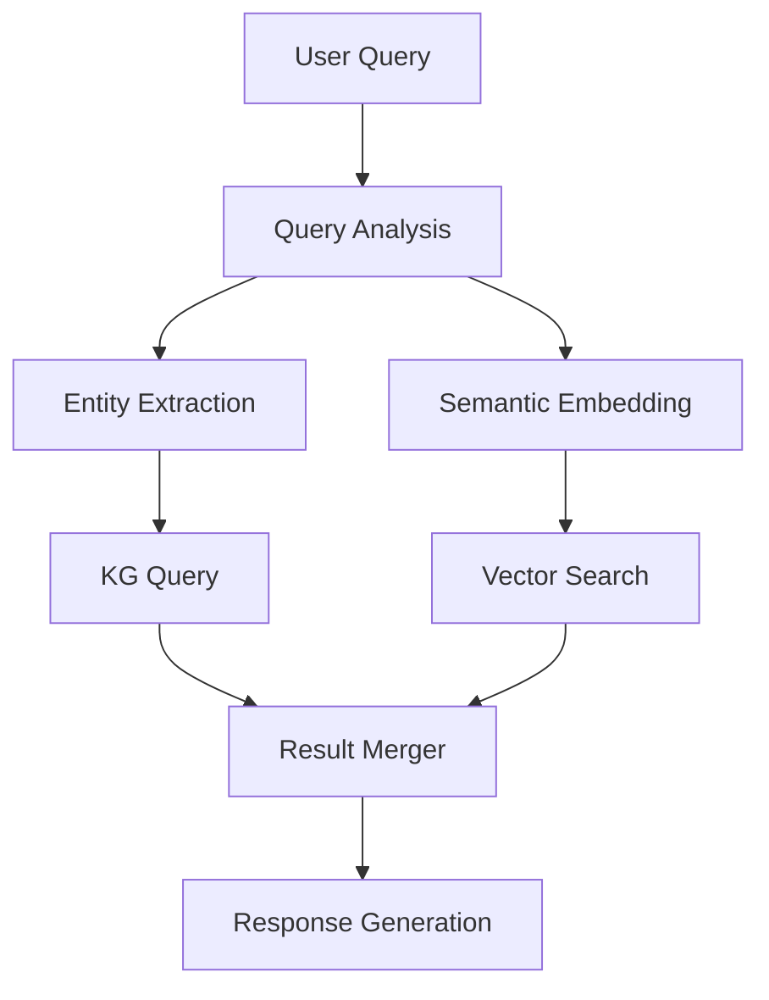

# 📚 Knowledge Base System

## Overview

The DataGovAI Knowledge Base is designed specifically for managing and querying Utah's General Retention Schedules (GRS). It combines advanced document processing with intelligent querying capabilities to provide accurate and context-aware responses about record retention requirements.

## System Components

| Component | Purpose | Implementation |
|-----------|---------|----------------|
| Document Processor | GRS document analysis | PyMuPDF + Custom Pipeline |
| Knowledge Graph | Structured data storage | PostgreSQL Relations |
| Vector Store | Semantic search | pgvector |
| Query Engine | Hybrid search system | RAG + KG |

## Document Categories

| Category | Count | Examples | Key Metadata |
|----------|-------|----------|--------------|
| Financial Records | 1,518 | • Budget docs<br>• Audit reports | • Retention period<br>• Fiscal year |
| Administrative | 791 | • Policies<br>• Procedures | • Department<br>• Review date |
| Public Services | 763 | • City records<br>• Utilities | • Service type<br>• Access level |
| Personnel | 558 | • HR files<br>• Applications | • Privacy level<br>• Review cycle |
| Education | 557 | • Student records<br>• Programs | • Academic year<br>• FERPA status |
| Legal | 426 | • Case files<br>• Warrants | • Case type<br>• Legal authority |
| Records Management | 399 | • File systems<br>• Archives | • Storage type<br>• Disposition |
| Property | 365 | • Permits<br>• Zoning | • Property type<br>• Location |
| Health | 348 | • Medical records<br>• Health services | • HIPAA status<br>• Record type |

## Data Model

### Document Structure

```json
{
    "document_id": "GRS-XXXXX",
    "metadata": {
        "title": "Document Title",
        "category": "Major Category",
        "subcategory": "Specific Type",
        "retention_period": {
            "duration": "7 years",
            "condition": "after fiscal year end",
            "exceptions": ["litigation hold"]
        },
        "disposition": {
            "action": "Destroy",
            "requirements": ["secure shredding"],
            "exceptions": ["historical value"]
        },
        "created_date": "YYYY-MM-DD",
        "last_modified": "YYYY-MM-DD"
    },
    "relationships": {
        "references": ["GRS-YYYY", "GRS-ZZZZ"],
        "supersedes": ["GRS-AAAA"],
        "related_to": ["GRS-BBBB"]
    },
    "access_control": {
        "classification": "Public",
        "restrictions": [],
        "authorized_roles": ["records-officer", "admin"]
    }
}
```

### Database Schema

| Table | Purpose | Key Fields |
|-------|---------|------------|
| documents | Main document storage | id, content, metadata |
| chunks | Semantic segments | doc_id, content, embedding |
| entities | Extracted entities | id, type, value, doc_id |
| relationships | Entity connections | source_id, target_id, type |
| audit_log | Change tracking | doc_id, action, timestamp |

## Processing Pipeline

### 1. Document Ingestion



### 2. Knowledge Extraction

| Stage | Process | Output |
|-------|---------|--------|
| Text Extraction | PDF/Document parsing | Clean text content |
| Metadata Parsing | Header/field analysis | Structured metadata |
| Entity Recognition | LLM-based extraction | Named entities |
| Relationship Mapping | Context analysis | Entity relationships |

### 3. Storage Process

| Data Type | Storage Method | Index Type |
|-----------|---------------|------------|
| Raw Documents | PostgreSQL JSONB | B-tree |
| Text Chunks | pgvector | HNSW |
| Relationships | PostgreSQL Graph | B-tree |
| Audit Trail | PostgreSQL TimescaleDB | Time-based |

## Query System

### Search Types

| Type | Method | Use Case |
|------|--------|----------|
| Exact Match | SQL Query | Known GRS numbers |
| Semantic | Vector Search | Concept-based queries |
| Hybrid | RAG + KG | Complex questions |
| Relationship | Graph Query | Related documents |

### Query Processing



## Usage Examples

See detailed examples in:
- [Document Examples](./examples/documents/)
- [Query Examples](./examples/queries/)

## Related Documentation
- [Data Model Details](./data_model.md)
- [Processing Pipeline](./processing.md)
- [Query System](./querying.md) 