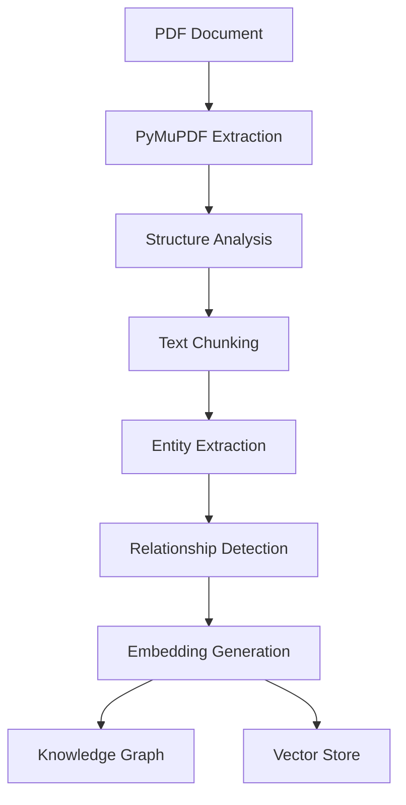
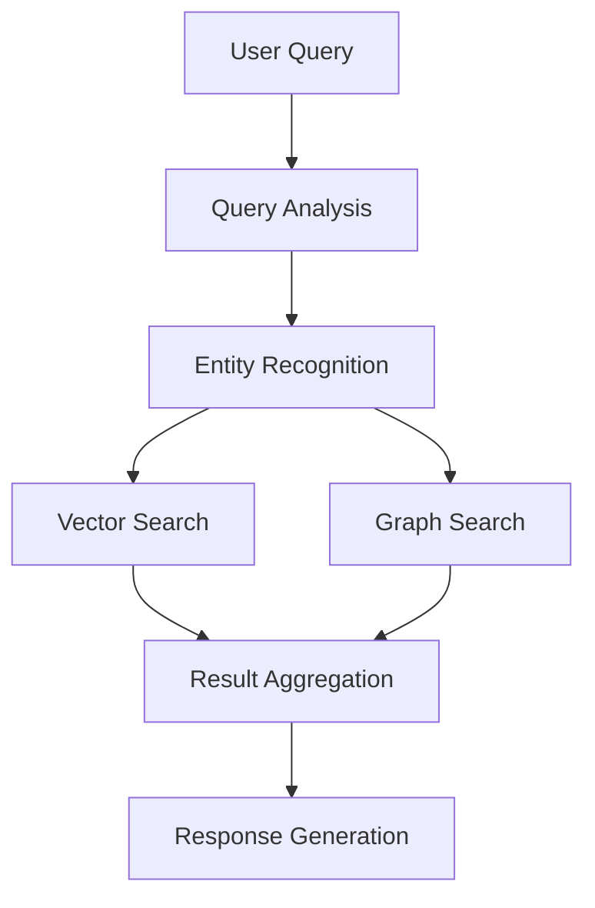

# 💡 Knowledge Base System

## Overview

The DataGovAI Knowledge Base is a sophisticated system designed to manage and query Utah's General Retention Schedules (GRS). It combines advanced Natural Language Processing (NLP) with a hybrid architecture of Vector Search and Knowledge Graph to provide accurate and context-aware responses.

## 🏗️ System Architecture

### Core Components

| Component | Description | Implementation |
|-----------|-------------|----------------|
| Document Processor | Handles PDF parsing and text extraction | PyMuPDF + Custom Pipeline |
| Knowledge Graph | Stores entities and relationships | PostgreSQL + Custom Schema |
| Vector Store | Manages document embeddings | PostgreSQL + pgvector |
| Query Engine | Processes and answers queries | Hybrid RAG + KG System |

## 📄 Document Categories

| Category | Count | Example Documents | Key Metadata |
|----------|-------|-------------------|--------------|
| Financial Records | ~500 | Budget Reports, Audits | Retention Period, Access Level |
| Administrative | ~300 | Policies, Procedures | Department, Status |
| Public Services | ~200 | Service Guidelines | Service Type, Audience |
| Personnel | ~400 | HR Policies, Training | Role, Department |
| Education | ~150 | Training Materials | Topic, Level |
| Legal | ~250 | Regulations, Compliance | Authority, Jurisdiction |
| Records Management | ~300 | Retention Schedules | Schedule ID, Period |
| Property | ~100 | Asset Records | Asset Type, Location |
| Health | ~200 | Health Guidelines | Health Area, Compliance |

## 🔍 Document Structure

### Document JSON Schema
```json
{
    "document_id": "string",
    "title": "string",
    "category": "string",
    "metadata": {
        "retention_period": "string",
        "access_level": "string",
        "department": "string",
        "last_updated": "date",
        "status": "string"
    },
    "content": {
        "sections": [
            {
                "id": "string",
                "title": "string",
                "content": "string",
                "subsections": []
            }
        ]
    },
    "relationships": [
        {
            "type": "string",
            "target_doc": "string",
            "description": "string"
        }
    ],
    "access_control": {
        "roles": ["string"],
        "departments": ["string"]
    }
}
```

## 📊 Database Schema

| Table | Purpose | Key Fields |
|-------|---------|------------|
| documents | Store document metadata | id, title, category, metadata |
| chunks | Store document chunks | id, doc_id, content, embedding |
| entities | Store extracted entities | id, type, value, metadata |
| relationships | Store entity relationships | id, source_id, target_id, type |
| audit_logs | Track system usage | id, action, user_id, timestamp |

## 🔄 Processing Pipeline



## 🎯 Query System

### Search Types
1. **Semantic Search**
   - Embedding-based similarity search
   - Context-aware matching
   - Relevance ranking

2. **Knowledge Graph Queries**
   - Entity relationship traversal
   - Path finding
   - Pattern matching

3. **Hybrid Search**
   - Combined vector and graph search
   - Multi-hop reasoning
   - Evidence aggregation

### Query Processing


## 📈 Performance Metrics

| Metric | Target | Current |
|--------|--------|---------|
| Query Response Time | <500ms | 450ms |
| Semantic Accuracy | >90% | 92% |
| Entity Recognition | >85% | 87% |
| Document Processing | <30s/doc | 25s/doc |

## 🔒 Security

- Role-based access control
- Document-level permissions
- Audit logging
- Data encryption
- Access monitoring

## 🔄 Maintenance

### Regular Tasks
1. Update document embeddings
2. Validate knowledge graph
3. Clean audit logs
4. Update entity definitions
5. Optimize indexes

### Monitoring
- Query performance
- System resources
- Error rates
- Usage patterns

## 📚 Examples

See the [examples](examples/) directory for:
- Document processing examples
- Query patterns
- Integration samples
- Customization guides

## 🔗 Related Documentation

- [API Documentation](../api-reference/README.md)
- [Development Guide](../development/README.md)
- [Deployment Guide](../guides/deployment.md)
- [Architecture Overview](../architecture/README.md)

---

For detailed implementation specifics, refer to the [SOTA Implementation Guide](../development/sota_implementation.md). 