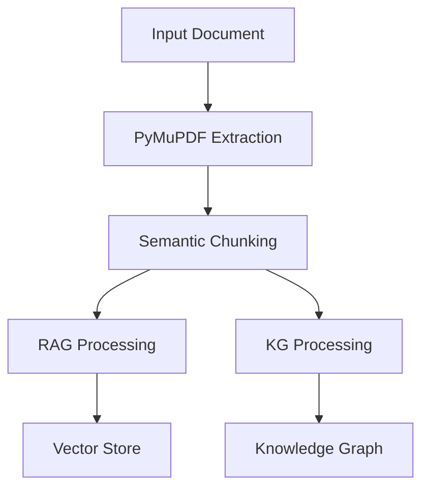
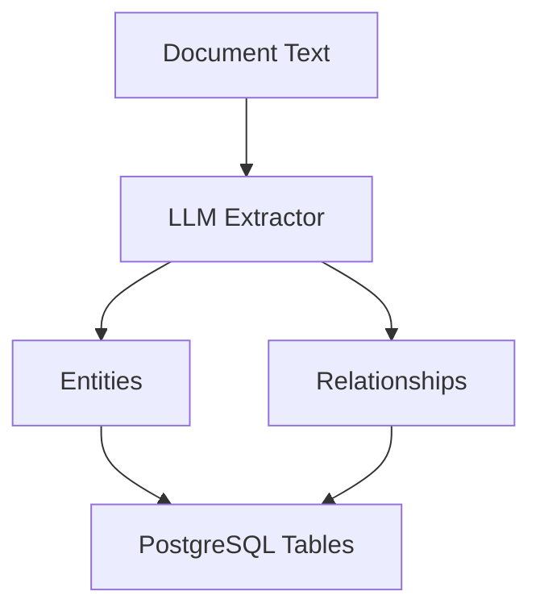
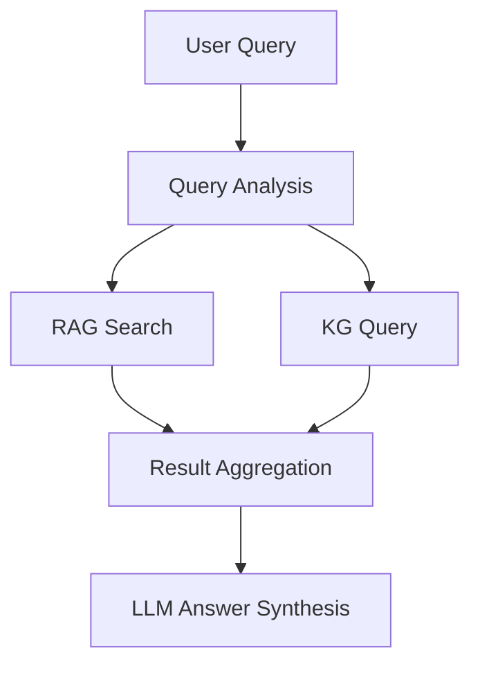

# Knowledge Base Architecture

## Overview

The Knowledge Base Agent uses a hybrid architecture combining Retrieval-Augmented Generation (RAG) with a Knowledge Graph (KG) to provide both semantic search capabilities and precise fact retrieval.

## Core Components

### 1. Document Processing Pipeline



- **PDF Extraction**: Uses PyMuPDF for robust text and layout extraction
- **Semantic Chunking**: NLTK/spaCy-based chunking preserving semantic context
- **Parallel Processing**: Documents feed into both RAG and KG pipelines

### 2. RAG Component (Vector Store)


- **Embedding Generation**: GPU-accelerated using SentenceTransformers
- **Vector Storage**: PostgreSQL with pgvector extension
- **Similarity Search**: Cosine similarity for semantic matching

### 3. KG Component (Knowledge Graph)



#### Entity Types
- Record Series Number
- Title
- Retention Period
- Disposition Action
- Legal Authority

#### Relationship Types
- HAS_RETENTION
- HAS_DISPOSITION
- SUPERSEDES
- REFERENCES
- RELATED_TO

### 4. Query Processing



## Database Schema

### Document Store
```sql
CREATE TABLE documents (
    id SERIAL PRIMARY KEY,
    content TEXT,
    metadata JSONB,
    created_at TIMESTAMP
);
```

### Vector Store (RAG)
```sql
CREATE TABLE chunks (
    id SERIAL PRIMARY KEY,
    document_id INTEGER REFERENCES documents(id),
    content TEXT,
    embedding vector(768)
);
```

### Knowledge Graph (KG)
```sql
CREATE TABLE entities (
    id SERIAL PRIMARY KEY,
    type VARCHAR(50),
    value TEXT,
    document_id INTEGER REFERENCES documents(id),
    metadata JSONB
);

CREATE TABLE relationships (
    id SERIAL PRIMARY KEY,
    source_id INTEGER REFERENCES entities(id),
    target_id INTEGER REFERENCES entities(id),
    type VARCHAR(50),
    metadata JSONB
);
```

## Query Patterns

### 1. Semantic Search (RAG)
```python
def semantic_search(query: str, top_k: int = 5) -> List[Document]:
    # Embed query
    query_embedding = embedding_model.encode(query)
    
    # Search vector store
    results = vector_store.similarity_search(
        query_embedding,
        top_k=top_k
    )
    return results
```

### 2. Knowledge Graph Query (KG)
```python
def kg_query(entity_type: str, value: str) -> List[Entity]:
    # Query knowledge graph
    results = knowledge_store.query(
        f"""
        SELECT e.*, r.*
        FROM entities e
        LEFT JOIN relationships r ON e.id = r.source_id
        WHERE e.type = :type AND e.value = :value
        """
    )
    return results
```

### 3. Hybrid Query (RAG+KG)
```python
def hybrid_query(query: str) -> Dict:
    # Get semantic results
    semantic_results = semantic_search(query)
    
    # Extract entities from query
    entities = llm_extractor.extract_entities(query)
    
    # Get knowledge graph results
    kg_results = []
    for entity in entities:
        kg_results.extend(kg_query(entity.type, entity.value))
    
    # Synthesize answer
    answer = llm_synthesizer.generate_answer(
        query=query,
        semantic_context=semantic_results,
        kg_context=kg_results
    )
    
    return {
        "answer": answer,
        "sources": semantic_results,
        "facts": kg_results
    }
```

## Performance Considerations

1. **Indexing**
   - Vector indexes for similarity search
   - B-tree indexes on entity types and values
   - GiST indexes for relationship traversal

2. **Caching**
   - Redis for frequent queries
   - Materialized views for common patterns
   - Embedding cache for popular chunks

3. **Optimization**
   - Batch processing for document ingestion
   - Parallel processing where possible
   - Query result caching

## Security

1. **Access Control**
   - Row-level security in PostgreSQL
   - Entity-level access control
   - Query rate limiting

2. **Data Protection**
   - Encryption at rest
   - Secure connections
   - Audit logging

## Monitoring

1. **Performance Metrics**
   - Query latency
   - Cache hit rates
   - Vector search performance
   - Knowledge graph traversal times

2. **Health Checks**
   - Database connectivity
   - Model availability
   - System resource usage

## Further Reading

- [Data Model](data_model.md)
- [Query Patterns](query_patterns.md)
- [Optimization Guide](optimization.md)
- [Security Guide](../guides/security.md) 