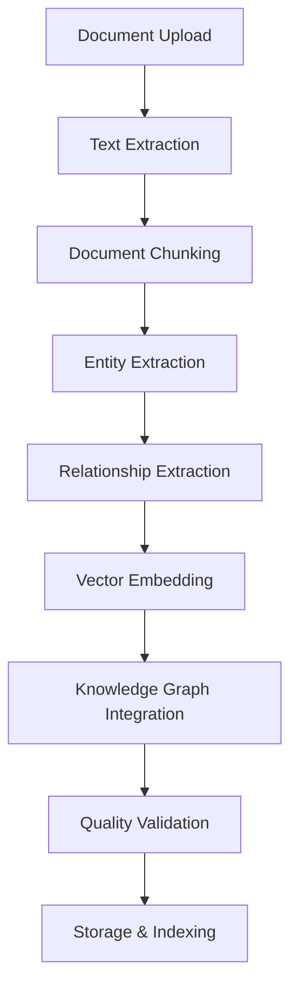

# 🔄 Document Processing Pipeline

## Overview

The DataGovAI document processing pipeline is responsible for ingesting, analyzing, and storing General Retention Schedule (GRS) documents. The pipeline transforms raw documents into structured knowledge that can be efficiently queried and analyzed.

## Pipeline Stages



## Stage Details

### 1. Document Upload
- **Input**: PDF files containing GRS documents
- **Process**:
  - File validation (format, size, corruption check)
  - Duplicate detection
  - Initial metadata extraction
- **Output**: Validated document ready for processing
- **Key Components**:
  ```python
  def validate_document(file_path: str) -> DocumentMetadata:
      # Validate file format
      if not file_path.endswith('.pdf'):
          raise InvalidFormatError()
      
      # Check file size
      if os.path.getsize(file_path) > MAX_FILE_SIZE:
          raise FileSizeError()
      
      # Extract basic metadata
      return extract_initial_metadata(file_path)
  ```

### 2. Text Extraction
- **Input**: Validated PDF document
- **Process**:
  - PDF parsing using PyMuPDF
  - Layout analysis
  - Text cleaning and normalization
- **Output**: Structured text with preserved formatting
- **Key Components**:
  ```python
  def extract_text(pdf_path: str) -> DocumentContent:
      doc = fitz.open(pdf_path)
      content = []
      
      for page in doc:
          # Extract text with layout preservation
          blocks = page.get_text("dict")["blocks"]
          for block in blocks:
              # Process text blocks
              content.append(process_block(block))
      
      return normalize_content(content)
  ```

### 3. Document Chunking
- **Input**: Extracted text content
- **Process**:
  - Semantic segmentation
  - Context preservation
  - Overlap handling
- **Output**: Document chunks with metadata
- **Configuration**:
  ```python
  CHUNK_CONFIG = {
      'max_chunk_size': 512,
      'overlap_size': 50,
      'preserve_sections': True,
      'min_chunk_size': 100
  }
  ```

### 4. Entity Extraction
- **Input**: Document chunks
- **Process**:
  - Named Entity Recognition (NER)
  - Pattern matching
  - Rule-based extraction
- **Output**: Extracted entities with metadata
- **Entity Types**:
  ```python
  ENTITY_PATTERNS = {
      'retention_period': r'\b\d+\s+years?\b|\bpermanent\b',
      'record_series': r'GRS-\d{4}-[A-Z]{3}-\d{3}',
      'legal_authority': r'Utah Code[^.]+\d+',
      'date': r'\d{4}-\d{2}-\d{2}|\b\d{1,2}/\d{1,2}/\d{4}\b'
  }
  ```

### 5. Relationship Extraction
- **Input**: Extracted entities and document context
- **Process**:
  - Dependency parsing
  - Co-occurrence analysis
  - Rule-based relationship extraction
- **Output**: Entity relationships with confidence scores
- **Key Components**:
  ```python
  def extract_relationships(
      entities: List[Entity],
      context: str
  ) -> List[Relationship]:
      relationships = []
      
      # Process entity pairs
      for e1, e2 in itertools.combinations(entities, 2):
          if are_related(e1, e2, context):
              relationship = create_relationship(e1, e2)
              relationships.append(relationship)
      
      return relationships
  ```

### 6. Vector Embedding
- **Input**: Document chunks
- **Process**:
  - Text preprocessing
  - Embedding generation using SentenceTransformers
  - Dimension reduction (optional)
- **Output**: Vector representations
- **Configuration**:
  ```python
  EMBEDDING_CONFIG = {
      'model_name': 'all-MiniLM-L6-v2',
      'max_seq_length': 512,
      'normalize_embeddings': True
  }
  ```

### 7. Knowledge Graph Integration
- **Input**: Entities and relationships
- **Process**:
  - Graph construction
  - Entity resolution
  - Relationship validation
- **Output**: Integrated knowledge graph
- **Key Components**:
  ```python
  def integrate_knowledge(
      entities: List[Entity],
      relationships: List[Relationship]
  ) -> KnowledgeGraph:
      graph = KnowledgeGraph()
      
      # Add entities
      for entity in entities:
          graph.add_node(entity)
      
      # Add relationships
      for rel in relationships:
          graph.add_edge(rel)
      
      return graph.validate()
  ```

### 8. Quality Validation
- **Input**: Processed document with all extracted information
- **Process**:
  - Completeness check
  - Consistency validation
  - Error detection
- **Output**: Validation report
- **Validation Rules**:
  ```python
  VALIDATION_RULES = {
      'required_fields': [
          'document_id',
          'title',
          'retention_period',
          'disposition'
      ],
      'consistency_checks': [
          'retention_period_format',
          'document_id_format',
          'relationship_validity'
      ]
  }
  ```

### 9. Storage & Indexing
- **Input**: Validated document data
- **Process**:
  - Database storage
  - Vector indexing
  - Graph database updates
- **Output**: Indexed and queryable document
- **Storage Operations**:
  ```python
  async def store_document(
      doc: ProcessedDocument,
      db: AsyncSession
  ) -> None:
      async with db.transaction():
          # Store document
          doc_id = await store_document_metadata(doc)
          
          # Store chunks and embeddings
          await store_chunks(doc_id, doc.chunks)
          
          # Store entities and relationships
          await store_knowledge_graph(doc_id, doc.graph)
          
          # Update indexes
          await update_indexes(doc_id)
  ```

## Error Handling

### Retry Mechanism
```python
RETRY_CONFIG = {
    'max_retries': 3,
    'backoff_factor': 2,
    'max_backoff': 30
}
```

### Error Types
1. **Document Errors**
   - Invalid format
   - Corruption
   - Size limits
2. **Processing Errors**
   - Text extraction failure
   - Entity recognition errors
   - Embedding generation failure
3. **Storage Errors**
   - Database connection issues
   - Transaction failures
   - Index corruption

## Monitoring

### Metrics
- Processing time per stage
- Success/failure rates
- Entity extraction accuracy
- Relationship confidence scores
- Storage performance

### Logging
```python
LOGGING_CONFIG = {
    'level': 'INFO',
    'handlers': ['console', 'file'],
    'format': '%(asctime)s - %(name)s - %(levelname)s - %(message)s'
}
```

## Performance Optimization

### Parallel Processing
- Chunk processing
- Entity extraction
- Embedding generation

### Caching
- Embeddings
- Frequent entities
- Common relationships

### Batch Processing
- Document batching
- Transaction batching
- Index updates

## Configuration Management

### Environment Variables
```bash
PROCESSING_BATCH_SIZE=10
MAX_CONCURRENT_TASKS=4
CACHE_TTL=3600
VECTOR_DIMENSION=768
```

### Feature Flags
```python
FEATURES = {
    'parallel_processing': True,
    'cache_embeddings': True,
    'validate_relationships': True,
    'auto_correction': False
}
```

## Integration Points

### Input Sources
- File system
- S3 bucket
- API endpoints

### Output Destinations
- PostgreSQL database
- Vector store
- Knowledge graph
- Audit logs

## See Also
- [Data Model](./data_model.md)
- [Query System](./querying.md)
- [API Reference](../api/README.md) 