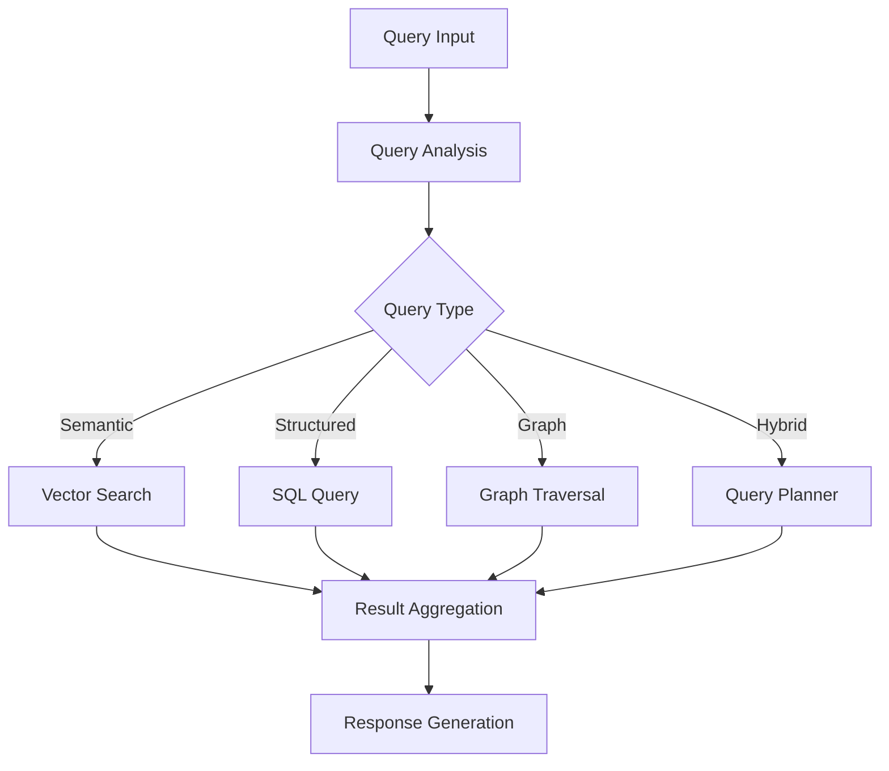

# 🔍 Query System Documentation

## Overview

The DataGovAI Query System provides a sophisticated interface for retrieving information from the GRS Knowledge Base. It combines semantic search, knowledge graph traversal, and structured queries to deliver accurate and contextual results.

## Query Types

### 1. Semantic Search
- Natural language queries
- Vector similarity matching
- Context-aware retrieval

### 2. Structured Queries
- Field-based filtering
- Metadata search
- Boolean operations

### 3. Graph Queries
- Entity relationship traversal
- Path finding
- Pattern matching

### 4. Hybrid Queries
- Combined semantic and structured search
- Graph-augmented retrieval
- Multi-hop reasoning

## Query Processing Flow



## Query Components

### 1. Query Parser
```python
class QueryParser:
    def parse(self, query: str) -> QueryPlan:
        # Analyze query intent
        intent = self.analyze_intent(query)
        
        # Extract query components
        components = self.extract_components(query)
        
        # Generate query plan
        return self.create_plan(intent, components)
    
    def analyze_intent(self, query: str) -> QueryIntent:
        # Determine query type and goals
        pass
    
    def extract_components(self, query: str) -> QueryComponents:
        # Extract entities, relationships, and constraints
        pass
```

### 2. Vector Search
```python
class VectorSearch:
    def __init__(self, model: SentenceTransformer):
        self.model = model
    
    async def search(
        self,
        query: str,
        filters: dict = None,
        top_k: int = 5
    ) -> List[SearchResult]:
        # Generate query embedding
        query_embedding = self.model.encode(query)
        
        # Execute vector search
        results = await self.find_similar(
            embedding=query_embedding,
            filters=filters,
            limit=top_k
        )
        
        return self.rank_results(results)
```

### 3. Graph Query Engine
```python
class GraphQueryEngine:
    async def query(
        self,
        start_node: Entity,
        pattern: GraphPattern,
        constraints: dict = None
    ) -> List[GraphResult]:
        # Initialize traversal
        traversal = self.create_traversal(start_node)
        
        # Apply pattern matching
        matches = await traversal.match(pattern)
        
        # Filter by constraints
        if constraints:
            matches = self.apply_constraints(matches, constraints)
        
        return matches
```

### 4. Query Planner
```python
class QueryPlanner:
    def create_execution_plan(
        self,
        query: QueryPlan
    ) -> ExecutionPlan:
        steps = []
        
        # Plan query execution steps
        if query.requires_vector_search:
            steps.append(self.plan_vector_search(query))
        
        if query.requires_graph_traversal:
            steps.append(self.plan_graph_traversal(query))
        
        if query.requires_filtering:
            steps.append(self.plan_filtering(query))
        
        return ExecutionPlan(steps)
```

## Query Examples

### 1. Semantic Search
```python
# Find documents about financial record retention
query = {
    'type': 'semantic',
    'text': 'What is the retention period for financial audit records?',
    'filters': {
        'category': 'financial'
    }
}

results = await query_engine.search(query)
```

### 2. Structured Query
```python
# Find all documents with 7-year retention period
query = {
    'type': 'structured',
    'conditions': {
        'metadata.retention.period': '7 years',
        'category': 'financial'
    },
    'sort': [
        {'field': 'created_at', 'order': 'desc'}
    ]
}

results = await query_engine.execute(query)
```

### 3. Graph Query
```python
# Find related documents through supersedes relationship
query = {
    'type': 'graph',
    'start': 'GRS-2024-FIN-001',
    'pattern': {
        'relationship': 'supersedes',
        'direction': 'outgoing',
        'depth': 3
    }
}

results = await query_engine.traverse(query)
```

### 4. Hybrid Query
```python
# Combine semantic search with graph traversal
query = {
    'type': 'hybrid',
    'semantic': {
        'text': 'audit requirements',
        'weight': 0.6
    },
    'graph': {
        'relationships': ['requires', 'references'],
        'weight': 0.4
    },
    'filters': {
        'category': 'financial'
    }
}

results = await query_engine.execute_hybrid(query)
```

## Result Processing

### 1. Ranking
```python
def rank_results(
    results: List[SearchResult],
    weights: dict = None
) -> List[RankedResult]:
    if weights is None:
        weights = {
            'semantic_score': 0.4,
            'freshness': 0.3,
            'authority': 0.3
        }
    
    ranked_results = []
    for result in results:
        score = calculate_combined_score(result, weights)
        ranked_results.append((result, score))
    
    return sorted(ranked_results, key=lambda x: x[1], reverse=True)
```

### 2. Aggregation
```python
def aggregate_results(
    results: List[QueryResult],
    strategy: AggregationStrategy
) -> AggregatedResult:
    if strategy == AggregationStrategy.MERGE:
        return merge_results(results)
    elif strategy == AggregationStrategy.INTERSECT:
        return intersect_results(results)
    elif strategy == AggregationStrategy.UNION:
        return union_results(results)
```

### 3. Response Formatting
```python
def format_response(
    results: List[QueryResult],
    format_type: ResponseFormat
) -> FormattedResponse:
    if format_type == ResponseFormat.JSON:
        return format_json(results)
    elif format_type == ResponseFormat.TEXT:
        return format_text(results)
    elif format_type == ResponseFormat.HTML:
        return format_html(results)
```

## Performance Optimization

### 1. Caching
```python
CACHE_CONFIG = {
    'vector_cache': {
        'max_size': 1000,
        'ttl': 3600
    },
    'query_cache': {
        'max_size': 500,
        'ttl': 1800
    }
}
```

### 2. Query Optimization
```python
def optimize_query(query: QueryPlan) -> OptimizedQuery:
    # Optimize vector operations
    if query.has_vector_search:
        query = optimize_vector_search(query)
    
    # Optimize graph traversal
    if query.has_graph_traversal:
        query = optimize_graph_traversal(query)
    
    # Optimize joins
    if query.has_joins:
        query = optimize_joins(query)
    
    return query
```

### 3. Batch Processing
```python
async def batch_process_queries(
    queries: List[Query],
    batch_size: int = 10
) -> List[QueryResult]:
    results = []
    
    for batch in chunks(queries, batch_size):
        batch_results = await asyncio.gather(
            *[process_query(q) for q in batch]
        )
        results.extend(batch_results)
    
    return results
```

## Error Handling

### 1. Query Validation
```python
def validate_query(query: Query) -> ValidationResult:
    errors = []
    
    # Validate query structure
    if not is_valid_structure(query):
        errors.append("Invalid query structure")
    
    # Validate parameters
    if not are_valid_parameters(query):
        errors.append("Invalid parameters")
    
    # Validate constraints
    if not are_valid_constraints(query):
        errors.append("Invalid constraints")
    
    return ValidationResult(valid=len(errors)==0, errors=errors)
```

### 2. Error Recovery
```python
async def execute_with_recovery(
    query: Query,
    max_retries: int = 3
) -> QueryResult:
    for attempt in range(max_retries):
        try:
            return await execute_query(query)
        except QueryError as e:
            if attempt == max_retries - 1:
                raise
            await backoff(attempt)
```

## Monitoring

### 1. Performance Metrics
```python
METRICS = {
    'query_latency': Histogram(),
    'result_count': Counter(),
    'cache_hits': Counter(),
    'error_rate': Counter()
}
```

### 2. Query Logging
```python
def log_query(
    query: Query,
    result: QueryResult,
    duration: float
):
    logger.info({
        'query_id': query.id,
        'type': query.type,
        'duration_ms': duration,
        'result_count': len(result.items),
        'timestamp': datetime.utcnow()
    })
```

## See Also
- [Data Model](./data_model.md)
- [Processing Pipeline](./processing.md)
- [API Reference](../api/README.md) 